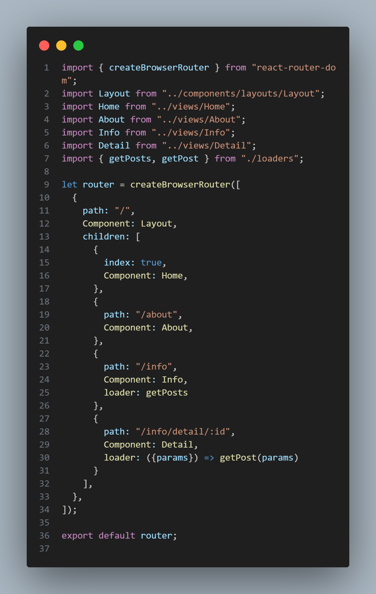

# React routing (Vite)

### Primo sistema routing con React e React Router

## Installare la libreria [React Router](https://reactrouter.com/home):
```bash
npm install react-router-dom
```
### Esempio di rotte nel file [Router.jsx](src/routing/Router.jsx)
